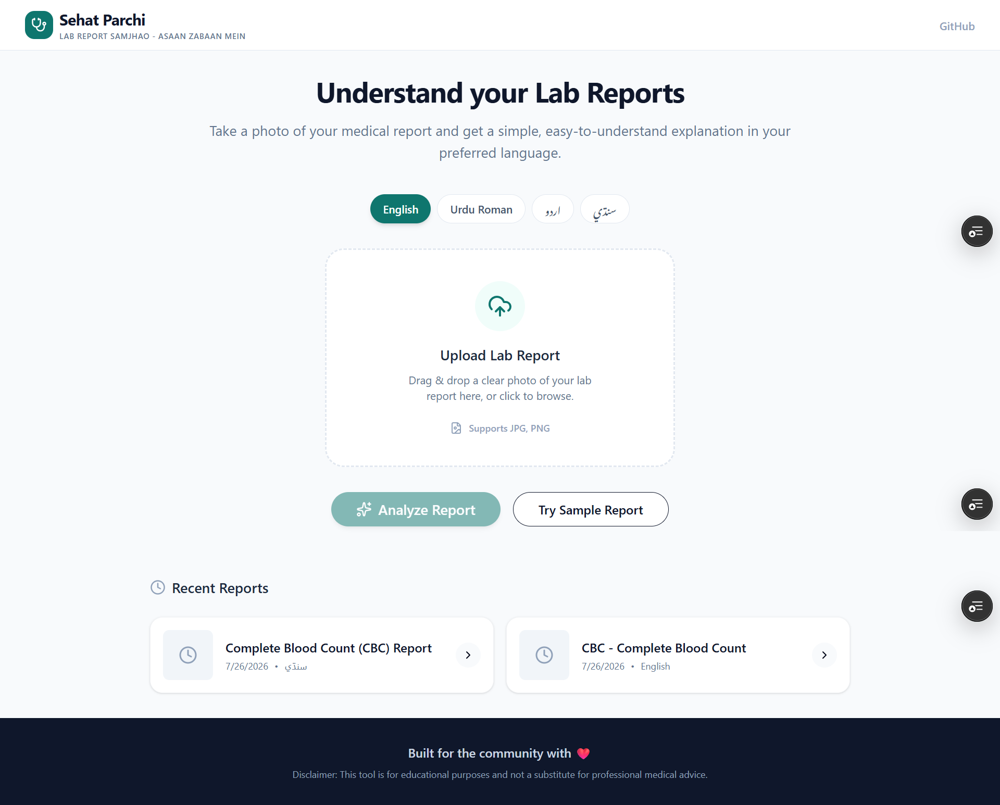
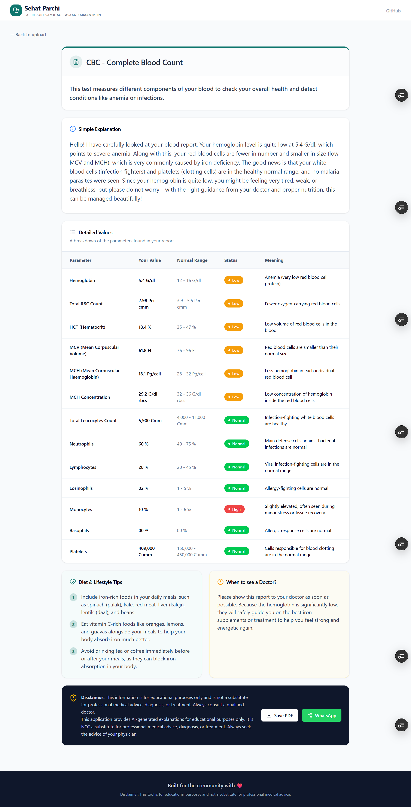
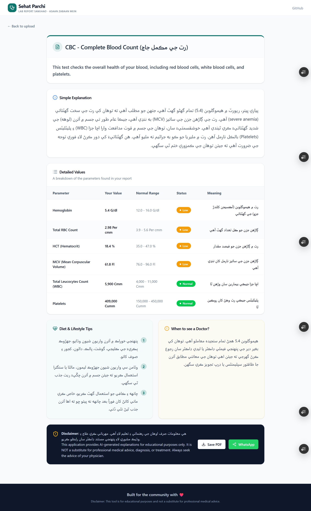
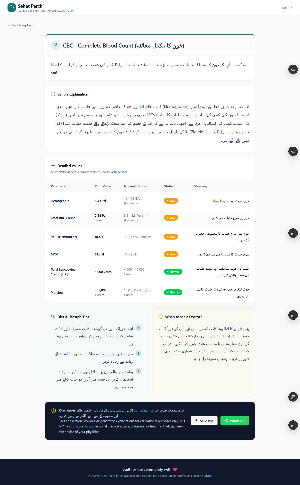

# 🩺 Sehat Parchi — Lab Report Samjhao

> Understand medical lab reports in simple language using AI.

---

# 📖 About the Project

Medical laboratory reports are often written in English and contain complex medical terminology that many patients and their families struggle to understand.

**Sehat Parchi** is an AI-powered web application that helps users understand their lab reports in simple and easy language. Users simply upload a picture of their medical report, choose their preferred language, and receive a clear explanation generated using Google Gemini AI.

The application supports:

- 🇬🇧 English
- 🇵🇰 Roman Urdu
- 🇵🇰 اردو (Urdu)
- 🏴 سنڌي (Sindhi)

This project was built as an individual AI application to improve healthcare accessibility for Pakistani communities by making medical reports easier to understand.

---

# 🌐 Live Demo

### 👉 https://sehat-parchi.vercel.app/

---

# 🚀 Features

- 📷 Upload medical lab reports (JPG / PNG)
- 🤖 AI-powered OCR and report analysis using Google Gemini
- 🌍 Multi-language support
  - English
  - Roman Urdu
  - Urdu
  - Sindhi
- 📊 Clean dashboard showing:
  - Test name
  - Test summary
  - Simple explanation
  - Detailed parameter table
  - Normal ranges
  - Status (Low / High / Normal)
  - Easy-to-understand meanings
- 🥗 Personalized diet & lifestyle tips
- 👨‍⚕️ Guidance on when to consult a doctor
- 🕘 Stores last 5 analyzed reports using browser Local Storage
- 🖨️ Print / Save report as PDF
- 💬 Share report through WhatsApp
- 📱 Fully responsive design
- 🧪 Built-in sample report for testing

---

# 🧠 AI Feature

Sehat Parchi uses **Google Gemini** to analyze uploaded medical lab reports.

The AI performs:

- OCR (reads text from the report)
- Extracts laboratory parameters
- Reads patient values
- Reads normal ranges
- Determines Low / High / Normal status
- Generates simple explanations
- Provides diet recommendations
- Advises when to consult a doctor
- Returns structured JSON used by the application

---

# 📝 AI System Prompt

```text
You are Sehat Parchi, a friendly Pakistani health educator. You are NOT a doctor and you never prescribe medicine.

User requested language: {LANGUAGE}

You will receive a laboratory report image.

Your task is to:

• Read the report using OCR
• Extract all laboratory parameters
• Read patient values
• Read normal ranges
• Classify values as Low, High or Normal
• Explain the report using simple language
• Return ONLY valid JSON
• Never prescribe medicines
• Never provide dosages
• Encourage consulting a qualified doctor when appropriate
```

---

# 🛠️ Technologies Used

| Category | Technology |
|----------|------------|
| Framework | Next.js 16 |
| Frontend | React 19 |
| Language | TypeScript |
| Styling | Tailwind CSS |
| Icons | Lucide React |
| AI SDK | Google Generative AI SDK |
| AI Model | Google Gemini |
| Storage | Browser Local Storage |
| Deployment | Vercel |
| Version Control | Git & GitHub |

---

# 📸 Screenshots

## Homepage



---

## English Report Analysis



---

## Urdu Report Analysis



---

## Sindhi Report Analysis



---

# 📂 Project Structure

```text
Sehat_Parchi
│
├── app
│   ├── api
│   ├── layout.tsx
│   └── page.tsx
│
├── components
├── lib
├── public
│   ├── samples
│   └── screenshots
│
├── types
├── package.json
└── README.md
```

---

# ⚙️ Installation

Clone the repository

```bash
git clone https://github.com/Sandeepmoorani/Sehat_Parchi.git
```

Go into the project

```bash
cd Sehat_Parchi
```

Install dependencies

```bash
npm install
```

Create `.env.local`

```env
GEMINI_API_KEY=your_gemini_api_key
```

Run the development server

```bash
npm run dev
```

Open

```
http://localhost:3000
```

---

# ☁️ Deployment

The application is deployed on **Vercel**.

Live URL:

https://sehat-parchi.vercel.app/

---

# 🔒 Privacy

- No user account is required.
- Reports are not stored in a database.
- Recent reports are stored only in the user's browser using Local Storage.
- Users should avoid uploading confidential medical documents they do not wish to share with an external AI provider.

---

# ⚠️ Medical Disclaimer

Sehat Parchi is an educational AI application.

It **does not** provide medical diagnosis, treatment, or prescriptions.

Always consult a qualified healthcare professional regarding medical concerns or laboratory reports.

---

# 🔗 Project Links

### Live Website

https://sehat-parchi.vercel.app/

### GitHub Repository

https://github.com/Sandeepmoorani/Sehat_Parchi

---

# 👨‍💻 Author

**Sandeep Moorani**

Final AI Project

Built with ❤️ for the community.
